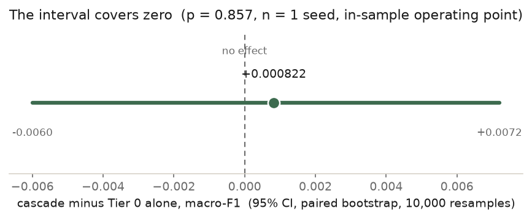
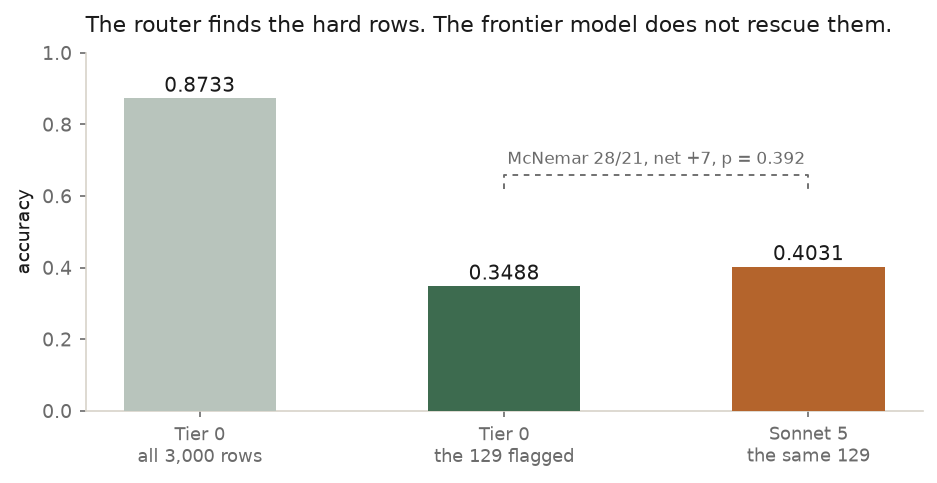
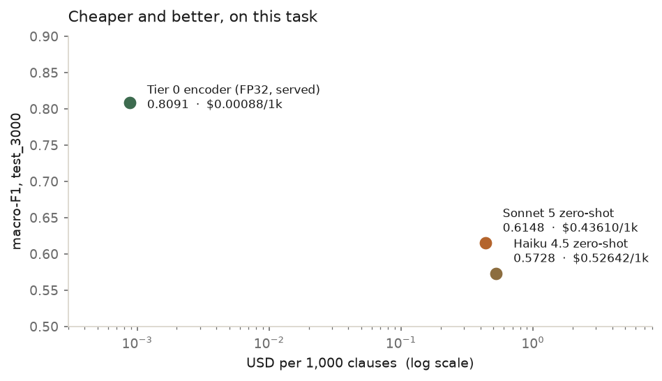
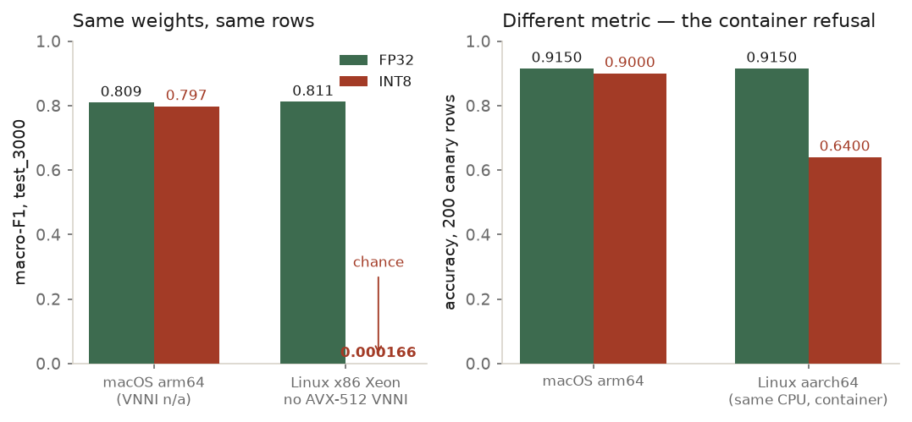
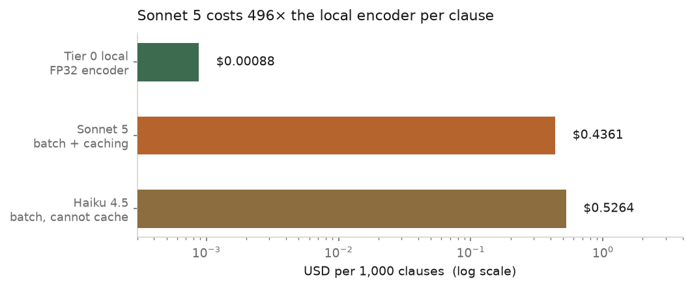

# Reasonable Doubt

**Legal clause classification, and whether routing to a frontier model is worth paying for.**

I built a three-tier cascade for LEDGAR clause classification, pre-registered the accept
rules, and measured whether the cascade saved money without losing accuracy. It did not
save money, because the middle and top tiers turned out to be unnecessary. The fine-tuned
encoder does the job on its own.

This report gives the numbers and the mistakes. The full pre-registration, including every
rule written before its run and every rejected experiment, is in
[PREREGISTRATION.md](PREREGISTRATION.md). Section references like §3bi point there.

---

## 1. What is running today

A single DeBERTa-v3-base encoder, fine-tuned on LEDGAR, exported to ONNX FP32, serving
100-class clause classification on CPU.

| | |
|---|---|
| **Served artefact** | E1b seed 1, ONNX FP32 (`onnx_ce10ep_1_fp32`) |
| **macro-F1, `test_3000`** | **0.8091** (arm64, FP32, single seed) |
| accuracy | 0.8733 |
| **Escalation to Claude** | **off** |
| Low-confidence rows | flagged `needs_review`, answered by the encoder |
| Cost | $0.00088 per 1,000 clauses |

Macro-F1 is the number to read. LEDGAR's classes are heavily long-tailed, so accuracy
flatters anything that gets the head classes right.

Seed 1 was picked on the selection split (`train_holdout_3000`: 0.8193 against 0.8151 and
0.8153). It is not the test-best of the three. Seed 3 is, at FP32 0.8139 against seed 1's
0.8111. Picking seed 3 would have turned the test set into a selection split, so the rule
cost 0.0028 of test macro-F1 and I followed it anyway.

The service exposes `/classify`, `/health`, and a one-page demo. It holds no API keys and
makes no network calls at inference. It is live on Cloud Run in Mumbai, scaled to zero:
<https://reasonable-doubt-111680840326.asia-south1.run.app>

The first request after an idle period takes about **150 seconds**, because nothing is
running between requests. Warm requests take **0.2 to 0.3 seconds**. The service needs
**4 GiB**; a 2 GiB revision failed to start with `Memory limit of 2048 MiB exceeded with
2087 MiB used`, a 2% overshoot, during the canary.

---

## 2. The premise, and what happened to it

The pre-registered design was a cost cascade. Tier 0 is a local encoder. Tier 1 is a
QLoRA-tuned small decoder. Tier 2 is the Claude API. A router sends each clause to the
cheapest tier that can handle it, and the deliverable is a cost-versus-accuracy frontier.

Both upper tiers fell out, for different reasons, and both were measured before they fell.

**Tier 1 lost to Tier 0.** E4 (Qwen2.5-1.5B-Instruct, QLoRA, n = 1 seed) reached macro-F1
0.7254 against a 0.7923 bar, a miss of 0.0669 and about 12× the test-set sigma. E4b was registered *before* E4 ran precisely so
that reporting a two-tier architecture could not read as a rescue after the fact.

**Tier 2 did not help the rows it was given.** At the served operating point the cascade
scores 0.809874 against Tier 0 alone at 0.809052. The difference is +0.000822, with a 95%
paired-bootstrap interval of [−0.0060, +0.0072] over 3,000 rows.


*The point estimate sits almost on zero and the interval covers it comfortably. n = 1 seed,
in-sample for the escalation rate.*

I turned escalation off after measuring this. The router still runs, and it is doing real
work: on the 129 rows it flags, the encoder scores 0.3488 against 0.8733 overall. The
signal finds hard clauses. Sonnet 5 answers those same rows at 0.4031.


*Both models are near-random on the flagged rows. McNemar over the 129: 28 wins to 21, net
+7, exact p = 0.392. The router works. The escalation target does not rescue it.*

This is the finding, not a failure of the design. A cascade is worth its complexity when
the expensive tier is better on the rows the cheap tier gets wrong. Here it is not, on this
task, at this operating point. The honest architecture is one tier plus a flag.

---

## 3. Findings

### The encoder beats zero-shot frontier models, and costs about 1/500th as much

Scored on all 3,000 `test_3000` rows through the same scorer:

| | macro-F1 | accuracy | USD / 1,000 clauses |
|---|---|---|---|
| **Tier 0 encoder (FP32, served)** | **0.8091** | 0.8733 | **$0.00088** |
| Sonnet 5, zero-shot | 0.6148 | 0.7487 | $0.43610 |
| Haiku 4.5, zero-shot | 0.5728 | 0.7210 | $0.52642 |


*One point per model, log cost axis. The encoder is up and to the left of both API models.*

The API costs are measured, not quoted: they come from `results/spend_ledger.jsonl`, the
actual batch runs, with the three usage fields read separately. Both API arms used the
Batch API with prompt caching enabled.

Sonnet 5 costs **496×** the encoder per clause on the full amortised local figure, which
includes the device capital. Against marginal energy alone the ratio is 36,656×. Those are
different quantities and the second one is not the interesting one.

One bound on this. Eight-shot prompting was tested and moved Sonnet 5 by +0.0018 macro-F1,
with a CI including zero (E8). But `exemplars_8` covers 6 classes out of 100, so eight
examples cannot teach a 100-way taxonomy. E8 falsifies "prompting closes the gap" **for the
8-exemplar prompt that was run**, and nothing more. A class-covering prompt is untested.

### INT8 collapses to chance on some CPUs, silently

This is the finding I did not expect and the one that changed the deployment.

The plan was to serve INT8. It is 3× smaller and the obvious choice. On Kaggle's Intel
Xeon, the INT8 export of the served weights scored macro-F1 **0.000166**. That is chance on
a 100-class problem. No error was raised anywhere. The same weights at FP32 scored 0.8115
in the same process.

That 0.8115 is the served model, scored on a different platform from the 0.8091 in section
1. The FP32 cross-ISA accuracy gap is **0.0024**, measured, and not zero.


*Left: macro-F1 on the same 3,000 rows, same weights. The Xeon has `avx512f` and `avx2` but
no `avx512_vnni`. Right: a different metric, the 200-row startup canary, showing the
container refusal.*

Then it happened again on ARM. The service container, running Linux aarch64 on the same
physical Mac, scored 0.6400 on the startup canary against 0.9000 on the host. Same
onnxruntime version, same numpy, byte-identical tokenizer output. 60 of 200 predictions
differed and logit correlation was 0.866, so this is broad numeric divergence in the
quantised kernel rather than a few bad rows. The container prints
`cpuid_info warning: Unknown CPU vendor`, which fits an ORT dispatch failure, but I did not
confirm the mechanism and do not claim it (§3bf).

The startup canary caught this. It classifies 200 fixed rows before the server binds and
refuses to start below a floor. It is the reason the service is FP32 today.

**FP32 never diverged in accuracy on any platform tested.** The served artefact scores
191/200 on macOS arm64, on Linux aarch64, on an emulated Linux x86 build, and on **real x86
hardware on Cloud Run**, against a floor of 0.80. On Cloud Run the margins match the local
arm64 values to four decimals (0.9867 and 0.1399 on two fixed clauses), so it is returning
the same answers and not merely the same accuracy.

> **THE CLOUD RUN MACHINE HAS `avx512_vnni: true`, AND THAT MATTERS MORE THAN THE PASS.**
> It is the first host in this project that has it. Kaggle's Xeon, where INT8 scored
> 0.000166, had `avx512f` and `avx2` but **no VNNI**, and the emulated x86 build had only
> `avx2`. So this deploy qualifies FP32 on x86-with-VNNI and says **nothing** about the
> hardware class that broke INT8. **The non-VNNI x86 case remains untested outside that
> one Kaggle run.** Reading "it passed on x86" as covering that class is exactly the
> generalisation this report is trying not to make.

**It is not bit-identical across those platforms either.** E1's artefact showed 0/200
prediction disagreements between host and container. The served E1b artefact shows
**1/200**, deterministically: two container runs are bit-identical to each other, and the
one disagreement reproduces every time. Logit correlation is 0.999144 and the largest
single logit difference is 2.785.

Accuracy was 191/200 on both sides, because the row in question is wrong on both. The two
platforms just picked different wrong labels. What moved is the margin on that row, 0.1004
on the host against 0.5724 in the container, which straddles the escalation threshold of
0.5289. One platform would have flagged that clause for review and the other would not.

This is the same hiding-in-plain-sight shape as the INT8 collapse, one order of magnitude
quieter. An accuracy check would have called the two platforms identical. **That is why the
canary compares predictions and not only the accuracy they add up to.** Whether a 1/200
cross-platform routing difference matters in production is not measured and I do not claim
either way (§3bk).

### The cheaper model costs more

Haiku 4.5's published rates are half of Sonnet 5's. Per clause it cost **1.21× more**
($0.52642 against $0.43610, both measured). The pre-registered note at §3j says 1.18×; that
was computed from projected costs before the batch ran, and 1.21× is what the ledger shows.

Haiku's minimum cacheable prefix is 4,096 tokens and its prefix under this prompt is 793,
short by 3,303. Sonnet 5's minimum is 1,024 and its prefix is 1,084, clearing by 60 tokens.
So Sonnet cached 3,240,000 tokens across the Stage 1 batch and Haiku cached zero.


*Measured, from the spend ledger. Haiku is the cheaper model on paper and the dearer one
per clause.*

The documentation is explicit that a short prompt "cannot be cached, and no error is
returned". The only way to see it is to read `cache_read_input_tokens` off every response.
I considered padding Haiku's prefix to 4,096 to make it cacheable and rejected it: the
prompt is pre-registered and hashed, and padding it after seeing the cost is what hard rule
6 exists to prevent (§3j).

Sonnet's 60-token margin is a live fragility. Any edit to the label list that shortens the
prefix below 1,024 silently disables caching and raises cost about 2.5× with no error.

### Softmax margin routes; verbalized confidence cannot

The router uses the encoder's top-two softmax margin. AUROC for predicting its own
correctness is 0.8622 ± 0.0035 over 3 seeds on the dev split.

Verbalized confidence from the API models is too compressed to route on. Over 1,000 rows,
Sonnet 5's self-reported confidence has sd 0.1598, mean 0.8514, and 31 distinct values,
against an accuracy of about 0.75. A separate probe (C2) tried to anchor it by fixing
`"confidence": 0.9` in all eight exemplars. The spread narrowed by 12% against a registered
bar of 50%, so the compression is a property of the model and not of my prompt.

I did not run a head-to-head AUROC of verbalized confidence against margin. The case rests
on the compression statistics, which is weaker than a direct comparison would have been.

### E1b missed its bar by 0.0013, and the bar did not move

E1b retrained Tier 0 at 10 epochs to test whether E1's shortfall was undertraining. The
registered rule was macro-F1 ≥ 0.80 on `test_3000`, INT8, mean over 3 seeds.

Result: **0.798744 ± 0.007018**. Short by **0.001256**, which is 0.18 of its own seed sd.
One of the three seeds clears 0.80 on its own. FP32 came in at 0.8064 and clears the bar,
but the rule names the INT8 artefact, so that is not a pass.

**Not accepted.** The registered text anticipated this case in advance: "if E1b lands at,
say, 0.79, that is a near-miss to be reported as a near-miss, not a rule to be relaxed
afterwards." That sentence existing before the number is the only reason this is reportable
rather than arguable.

The hypothesis was still supported. On the one-variable comparison (same host, 3 epochs
versus 10, both environments recorded) the gain is **+0.0386** at n = 1, computed from the
two run files. (§3be reports +0.0385, the difference of two four-decimal rounded figures.) Undertraining
explains most of E1's gap and not all of it. Selection best was the final epoch for two of
three seeds, so 10 epochs is plausibly still short. That is an observation and not a
rescue; a 20-epoch run is a new experiment needing its own registration.

### The FP32-versus-INT8 speed penalty is unresolved

FP32 throughput on the same artefact came out at 24.2966 req/s in one session (9 runs
across three artefacts) and 29.1437 req/s in a later one (3 runs). An interleaved control settled which effect that was: alternating the two artefacts
in one session gives an artefact difference of +0.72 req/s, inside the within-session sd,
while the same artefact across sessions moves **+19.95%**.

So the throughput difference is measurement conditions, not weights. The consequence is
larger than the question: the INT8 row was measured in a third session, and the
session-to-session drift is bigger than the INT8-to-FP32 gap. Arithmetically `costs.yaml`
now says FP32 is both faster and 8.4% cheaper than INT8. I do not believe that and do not
claim it. **The precision speed penalty on this host is unmeasured.** Settling it needs an
interleaved INT8-versus-FP32 run in one session, which has not been done.

The deployment decision does not depend on it. FP32 is served because it is the only
precision qualified on a Linux target.

---

## 4. What I got wrong

Every one of these produced a plausible number. That is what makes them worth listing.

**A parameter validated on one model, assumed for another.** `temperature` was
range-checked and type-checked on Haiku 4.5, with an unknown-field control, and the
conclusion carried over to Sonnet 5. Sonnet 5 returns `` `temperature` is deprecated for
this model``. The smoke test passed only because Haiku ran first. The rule now is one
reading per model and per endpoint; sync and batch are different paths (§3e).

**The spend cap read the wrong ledger.** The service's $1.00 escalation cap was checked
against the entire ledger, which holds about $3.58 of offline experiment spend. The cap was
therefore permanently reached from the first request. The service refused every escalation
and returned `escalation_skipped=true` every time, which looks exactly like a healthy
service whose router never fires. Fixed by scoping the cap to its own `run_id`.

**A precision label hardcoded in provenance.** `score_int8_local.py` and
`dev_logits_int8_local.py` both wrote `precision: "int8"` into the saved logits regardless
of the artefact. Both scripts accept any ONNX directory, and the service moved to FP32, so
FP32 logits were being stamped INT8 in their own provenance block. The threshold calibrator
asserts on exactly that field. Caught when the label appeared in a run I knew was FP32.
`--precision` is now required with no default.

**A 10,000-row array scored as if it were 3,000.** `test_logits` is the full 10k test split
in every Tier 0 npz, while `test_3000` is a 3,000-row manifest subset selected by an index
array. `score_npz(split="test_3000")` read the array whole and returned 0.766747 over
n=10,000 while labelling it `test_3000`, against the recorded 0.763591 over n=3,000. No
published number was affected, because the only callers were tests. It was latent in
shipped code, not in analysis, and a guard now fails loudly on the length mismatch.

**A cost figure describing a different system than the one answering.** Every `/classify`
response reported an INT8-derived cost while the service ran FP32. I predicted it
understated by about 15%. It overstated by 9.2%, and I had the sign wrong. Pricing is now
keyed to the served precision and raises rather than borrowing the other precision's
numbers when one is unmeasured.

---

## 5. Limitations

**Single seed where it says single seed.** The served 0.8091 is one training run. It has no
variance estimate. E1b's 3-seed mean exists for INT8 (0.798744 ± 0.007018), and the served
FP32 number is not that.

**The operating point is in-sample.** The router threshold value is calibrated on dev only,
which keeps hard rule 1 intact. The 4.056% escalation *rate* that the threshold targets was
selected on test. Any cascade accuracy, escalation rate, or cost figure read off
`test_3000` at that rate is in-sample for the rate that chose it (§3bc).

**E3's statistic is ambiguous and I did not resolve it.** The rule reads `|INT8 − FP32| ≤
0.01, paired` and never says per-seed or 3-seed mean. Per seed, E1b seed 1 fails at 0.0137.
On the mean it passes at 0.0077. E1 passes both ways, so the readings never diverged before.
Choosing now means choosing after seeing which one fails, so both are recorded and neither
is adopted (§3bj).

**x86 is now qualified for FP32, on one CPU type only.** The canary passes at 191/200 on
Cloud Run, on real x86. That machine reports `avx512_vnni: true`. The CPU where INT8
collapsed to 0.000166 reported `avx512_vnni: false`, and **no FP32 measurement has ever
been taken on a non-VNNI x86 host outside that single Kaggle run**. Treat the x86
qualification as covering VNNI-capable x86 and nothing wider.

**Flagged rows have no review path.** `needs_review` is honest about uncertainty and does
nothing about it. The clause still gets an encoder answer. The human review the flag
implies does not exist.

**The electricity tariff is assumed.** $0.0847/kWh is a guess at a domestic slab, supplied
in conversation and never read off a bill. Every local USD figure inherits it.
`src/eval/breakeven.py` refuses it unless a caller asks for it by name. Power is SoC package
only, excluding RAM, PSU losses and fans, so it is not wall power.

**Frontier and break-even figures are E1 results.** The E6 cost-versus-volume curve, its
Pareto points, and the break-even volume were computed on E1's INT8 artefacts. They have
not been rebuilt against E1b and must not be read as describing the served model.

**The split is chronological.** Train is 2016–2017, test is 2019. These numbers describe
2019 SEC EDGAR Exhibit-10 filings. Other jurisdictions, contract types and languages are
untested.

---

## 6. Reproduction

**Model.** <https://huggingface.co/sidharthjatt/reasonable-doubt-deberta-ledgar>

```
model.onnx  sha256  e70fb095ee8ddd82c9449d6da0006b4fa1c7a92bb8547d5538f869c445010200
```

The card lists a sha256 for all seven files. An anonymous download was verified against the
local bytes before publication.

**Run the service.**

```bash
docker build -t reasonable-doubt:local . && docker run --rm -p 8000:8000 -v "$PWD/models:/models:ro" -e TIER0_MODEL_DIR=/models/onnx_ce10ep_1_fp32 reasonable-doubt:local
```

The startup canary classifies 200 fixed rows before uvicorn binds and exits non-zero below
the floor. A Docker Space deployment is staged in `deploy/space/`, where the model is pulled
from the model repo at build time and verified by sha256.

**Deploy to Cloud Run.** `deploy/cloudrun/` holds the image and build script. The model is
**baked into the image** rather than downloaded at startup, and its published sha256 is
checked at build time so a wrong artefact fails the build instead of reaching production.

```bash
./deploy/cloudrun/build_and_push.sh
```

```bash
gcloud run deploy reasonable-doubt --image=asia-south1-docker.pkg.dev/<project>/services/reasonable-doubt:<tag> --region=asia-south1 --memory=4Gi --cpu=1 --min-instances=0 --max-instances=2 --concurrency=4 --timeout=120 --allow-unauthenticated --port=8080 --startup-probe=tcpSocket.port=8080,periodSeconds=10,timeoutSeconds=5,failureThreshold=30
```

`--max-instances=2` is the spend cap. The startup probe has to be generous: the canary
takes about two minutes on one vCPU, and the port does not open until it finishes.

**Rebuild the ONNX export.** The export toolchain is pinned in `requirements-export.txt` as
an overlay, because the repo venv has drifted off it and optimum's exporter will not import
against the newer transformers. That file carries a control: re-exporting E1's weights
through it reproduces the currently-served `onnx_ce_1_fp32` byte-for-byte.

**Regenerate this report's figures.**

```bash
python scripts/build_report_inputs.py && python scripts/make_report_figures.py
```

Every figure reads a JSON file in `results/`. Those files are committed.

---

*Training ran on Kaggle T4s. Serving and all timing numbers are from an Apple Silicon Mac
Mini. Total Claude API spend across the project: $3.59 of a $15 budget, itemised in
`results/spend_ledger.jsonl`.*
